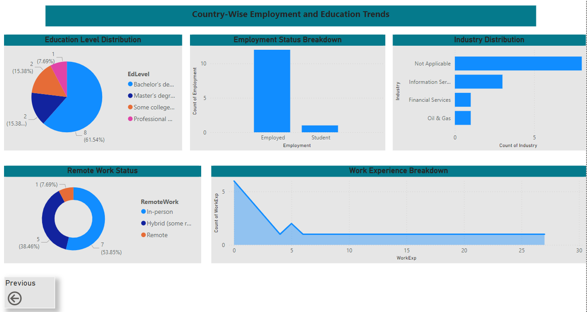

# Stack Overflow Users Survey Analysis  

  
  
  
  
  

## 📌 Overview  
This project presents an **interactive Power BI dashboard** analyzing **Stack Overflow users' demographics, professional background, engagement trends, and technology preferences** (programming languages, databases, platforms, and AI tools). The dashboard provides **data-driven insights** through **visual analytics, drill-down, and drill-through capabilities**.  

## 🛠 Tools & Technologies  
- **Power BI** – Data visualization & interactive reports  
- **DAX (Data Analysis Expressions)** – Custom calculations & metrics  
- **SQL** – Data extraction & transformation  
- **Feature Engineering** – Data cleaning, formatting, and structuring  
- **Power Query** – ETL (Extract, Transform, Load)  

## 🔍 Approach  
1. **Data Cleaning & Preparation** – Handled missing values, formatted columns, and performed feature engineering.  
2. **Dashboard Design** – Developed an **interactive Power BI dashboard** with drill-down and drill-through features.  
3. **Visualizations** – Created insights on **user demographics, professional background, engagement trends, and technology usage**.  
4. **DAX Calculations** – Implemented **custom measures and aggregations** for deeper insights.  

## 📊 Results  
- **Comprehensive insights** into Stack Overflow user demographics and professional trends.  
- **Interactive technology usage analysis** across programming languages, databases, and AI tools.  
- **Drill-through capabilities** enabling detailed exploration of user behaviors.  

## 📸 Visuals  

### 🌍 Main Dashboard - User Demographics & Engagement  
Displays **age groups, countries, employment status, work experience, and Stack Overflow engagement levels**.  
  

### 🖥️ Technology Usage & Preferences  
Analysis of **programming languages, platforms, databases, and AI tool preferences**.  
  

### 📊 Drill-Through Analysis by Country  
Detailed **breakdown of education levels, employment types, industry, and remote work preferences** for each country.  
  

## 🚀 Future Enhancements  
- **Incorporate machine learning** to predict trends in technology adoption.  
- **Enhance interactivity** with more dynamic filtering options.  
- **Expand analysis** to include career progression trends over time.  
